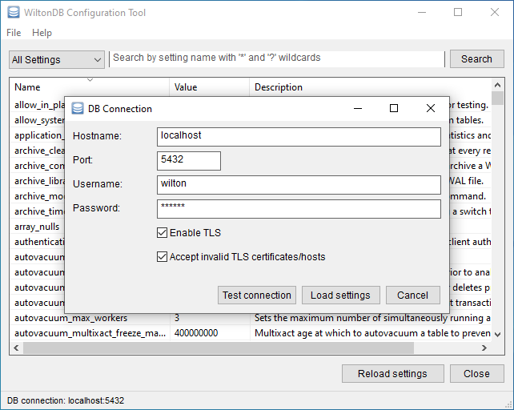

WiltonDB Configuration Tool
===========================

GUI configuration tool that allows to change DB system parameters.

License information
-------------------

This project is released under the [Apache License 2.0](http://www.apache.org/licenses/LICENSE-2.0).